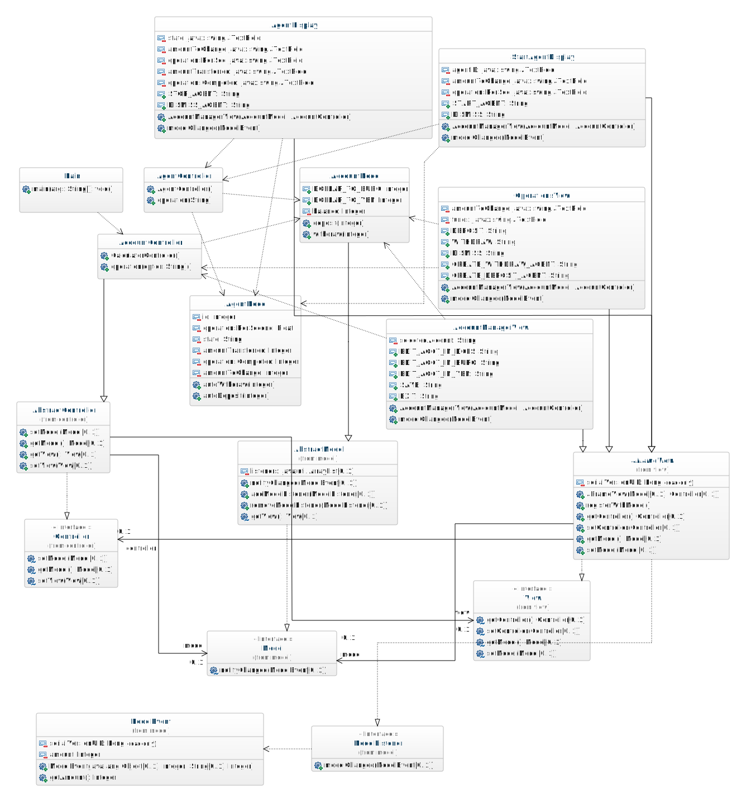

# Cash Account Manager
A software system for account management using "push" Model View Controller architecture. 

## Program Requirements
See word document in root.
    
## GUI/Display
<object data="media/display.pdf" type="application/pdf" width="700px" height="700px">
    <embed src="media/display.pdf">
        This browser does not support PDFs. Click to view or download PDF: <a href="media/display.pdf">Download PDF</a>.

    </embed>
</object>

## Class Diagram

### Built With
* [Eclipse](https://eclipse.org/ide/) - Eclipse Java Integrated Development Environment (IDE)

### Authors
* **Patrick Martinez** - *Initial work* - [martip23](www.github.com/martip23)
